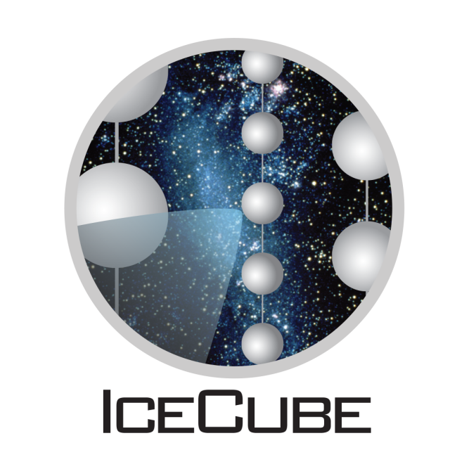

.. _About:

About
=====

The `IceCube Neutrino Observatory <https://icecube.wisc.edu/>`_ is a cubic-kilometer neutrino detector operating at the geographic South Pole, Antarctica. Approximately 300 physicists from 50 institutions in 12 countries make up the IceCube Collaboration. The international team is responsible for the scientific program, and many of the collaborators contributed to the design and construction of the detector.

Authors
-------

nuflux is a written by the IceCube Collaboration. You can find the github project `here <https://github.com/icecube/nuflux>`_.

nuflux is currently maintained by:

| Kevin Meagher (UW Madison), kmeagher@icecube.wisc.edu
