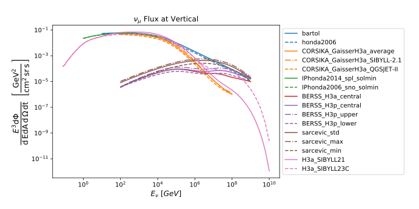

.. _fluxes:

Flux Models
===========

This section contains a list of fluxes supported by nuflux.
All available fluxes were created with different combinations of primary
CR and hadronic interaction models (refer to the :ref:`physics <physics>` section).
Not all models are suitable for all neutrino energies.
The plot below can give an idea of which model covers which energy range;
however, note that it is up to the analyser to make sure a chosen flux is valid for their physics requirements.

H3a_SIBYLL23C
---------------------------
.. _H3a_SIBYLL23C:

Variants: ``H3a_SIBYLL23C`` (total), ``H3a_SIBYLL23C_pr`` (total prompt),
``H3a_SIBYLL23C_conv`` (total conventional), ``H3a_SIBYLL23C_k`` (from :math:`K^{\pm}` decay),
``H3a_SIBYLL23C_K0`` (from :math:`K^{0}` decay), ``H3a_SIBYLL23C_K0L`` (from :math:`K^{0}_{L}` decay),
``H3a_SIBYLL23C_K0S`` (from :math:`K^{0}_{S}` decay), ``H3a_SIBYLL23C_pi`` (from :math:`\pi` decay),
``H3a_SIBYLL23C_mu`` (from :math:`\mu` decay).

| **Physics extents**
| Available (anti)neutrino flavors: :math:`e, \mu, \tau`  (some flux variants might support fewer flavors)
| :math:`10^{-2} < E_{kin} \text{[GeV]} < 10^{10}`
| :math:`-1 < \cos(\theta) < 1`

The H3a_SIBYLL23C fluxes are calculated with MCEq 1.2.1 assuming the primary CR model HillasGaisser2012 (H3a),
and the hadronic interaction model Sibyll 2.3C. In contrast to the H3a_SIBYLL21, :math:`\tau` flavor is  supported.
The resulting 2D tables were interpolated with the B-spline method using photospline 2.0.4.
They are evaluated using the ``SplineFlux2`` class.

H3a_SIBYLL21
---------------------------
.. _H3a_SIBYLL21:

Variants: ``H3a_SIBYLL21`` (total), ``H3a_SIBYLL21_conv`` (total conventional), ``H3a_SIBYLL21_k`` (from :math:`K^{\pm}` decay),
``H3a_SIBYLL21_K0`` (from :math:`K^{0}` decay), ``H3a_SIBYLL23C_K0L`` (from :math:`K^{0}_{L}` decay),
``H3a_SIBYLL23C_K0S`` (from :math:`K^{0}_{S}` decay), ``H3a_SIBYLL21_pi`` (from :math:`\pi` decay),
``H3a_SIBYLL21_mu`` (from :math:`\mu` decay).

| **Physics extents**
| Available (anti)neutrino flavors: :math:`e, \mu` (some flux variants might support fewer flavors)
| :math:`10^{-2} < E_{kin} \text{[GeV]} < 10^{10}`
| :math:`-1 < \cos(\theta) < 1`

The H3a_SIBYLL21 fluxes are calculated with MCEq 1.2.1 assuming the primary
CR model HillasGaisser2012 (H3a) and the hadronic interaction models Sibyll 2.1.
The resulting 2D tables were interpolated with the B-spline method using photospline 2.0.4.
They are evaluated using the ``SplineFlux2`` class.

BERSS_H3a
---------
.. _BERSS_H3a:

Variants: ``BERSS_H3a_central``

The prompt atmospheric calculation from Bhattacharya *et al.* assuming the Gaisser H3a cosmic ray spectrum as input.
The version included in this library was obtained by fitting a spline to data supplied by the authors of
that paper to Joanna Kiryluk on or about 2015-02-09 with the following assumptions:
1) The flux is independent of zenith angle
2) The flux is the same for all flavors of neutrinos
(and antineutrinos) except nu_tau, for which it is zero.

Bhattacharya *et al.*, J. High Energ. Phys. **2015**, 110 (2015).
`arXiv:1502.01076 <https://arxiv.org/abs/1502.01076>`_.

BERSS_H3p
---------
.. _BERSS_H3p:

Variants: ``BERSS_H3p_central``, ``BERSS_H3p_lower``, ``BERSS_H3p_upper``

The family of prompt atmospheric calculation from Bhattacharya *et al.*
assuming the 'Gaisser H3p' (all proton) cosmic ray spectrum as input.
These fluxes represent the lower, central and upper points on the error band due to QCD uncertainties
(cosmic ray flux uncertainties are not included) obtained in that paper.
The version given here is constructed in the same manner as for BERSS_H3a_central
(with the same assumptions about the angular distribution and neutrino flavors).

CORSIKA_GaisserH3a
------------------
.. _CORSIKA_GaisserH3a:

Variants: ``CORSIKA_GaisserH3a_QGSJET-II``, ``CORSIKA_GaisserH3a_SIBYLL-2.1``, ``CORSIKA_GaisserH3a_average``

This flux is the atmospheric neutrino flux (ANFlux) from direct CORSIKA calculation.
A large Monte Carlo set of a modified version of CORSIKA (v. 7.4003),
to allow for the shower output to be serialized into ROOT files,
was run for different hadronic interaction models.
The neutrino flux at various directions was histogramed and then weighted to the Gaisser H3a cosmic-ray flux.
Then these histogram were splined using photospline.

Schöneberg, Sebastian, The spectrum of atmospheric neutrinos above GeV energies, `PhD Thesis, Ruhr Universität Bochum, 2016 <https://hss-opus.ub.ruhr-uni-bochum.de/opus4/frontdoor/index/index/docId/5268>`_.

IPhonda2006_sno_solmin, IPhonda2014_spl_solmin, IPhonda2014_spl_solmax, IPhonda2014_sk_solmin, IPhonda2014_sk_solmax
--------------------------------------------------------------------------------------------------------------------
.. _IPhonda2006_sno_solmin:
.. _IPhonda2014_spl_solmin:
.. _IPhonda2014_spl_solmax:
.. _IPhonda2014_sk_solmin:
.. _IPhonda2014_sk_solmax:

Despite being continuous across energy, azimuth angle, and zenith angle, the fluxes commonly used
for atmospheric neutrino estimates are provided from models at discrete points in (energy, azimuth, zenith).
For models where the data is generated not at specific points but over suitably small
ranges of (energy, azimuth, zenith)—such as the Monte Carlo simulation methods from M. Honda.
It is important to preserve the integral of the flux over the 3-dimensional voxel as part of the smoothing process.
For the Honda fluxes the integral preserving (IP) fluxes were developed by Steven Wren,
where “the basic premise is to calculate splines of the integral of the data rather than the data itself.
Then, to calculate the interpolated value of the original data at the desired point in the parameter space,
one just evaluates the first derivative of these splines.

The tables presented here are based on Honda 2006 location at SNO during the solar minimum/ Honda 2014
location at South Pole and Kamioka during the solar minimum and maximum.

Wren, Steven, "Neutrino Mass Ordering Studies with IceCube-DeepCore",
`PhD Thesis, University of Manchester, 2018.
<https://research.manchester.ac.uk/en/studentTheses/neutrino-mass-ordering-studies-with-icecube-deepcore>`_.

bartol
------
.. _bartol:

The interaction model is published in Barr *et al.* and tables are available from `Barr's web page <http://www-pnp.physics.ox.ac.uk/~barr/fluxfiles/0408i/index.html>`_.

| Barr *et al.*, Phys. Rev. D **70**, 023006 (2004). `astro-ph/0403630 <https://arxiv.org/abs/astro-ph/0403630>`_.
| Barr *et al.*, `28th International Cosmic Ray Conferenece (ICRC2003) 1411. <http://www-rccn.icrr.u-tokyo.ac.jp/icrc2003/PROCEEDINGS/PDF/351.pdf>`_.

honda2006
---------
.. _honda2006:

Alternative Knee Models: ``gaisserH3a_elbert``, ``gaisserH4a_elbert``, ``gst13_elbert``,
``gst13star_elbert``, ``polygonato_mod_elbert``

Original tables from Honda's web page (Dead link: ``https://www.icrr.u-tokyo.ac.jp/~mhonda/``).

Honda *et al.*, Phys. Rev. D **75**, 043006 (2007).
`astro-ph/0611418 <https://arxiv.org/abs/astro-ph/0611418>`_.

sarcevic
--------
.. _sarcevic:

| Variants: ``sarcevic_max``, ``sarcevic_min``, ``sarcevic_std``
| Alternative Knee Models: ``gaisserH3a_elbert``, ``gaisserH4a_elbert``, ``polygonato_mod_elbert``

For prompt neutrinos a new model is available by R. Enberg *et al.*
This is a pqcd model where parameters where changed so that the model is provided
as a best prediction (std) and a max and min ones that provide the uncertainty.
Some of the highest predictions (_opt models can be discarded since they seem really too optimistic!)

Enberg *et al.*, Phys. Rev. D **78**, 043005 (2008). `arXiv:0806.0418 <https://arxiv.org/abs/0806.0418>`_.
